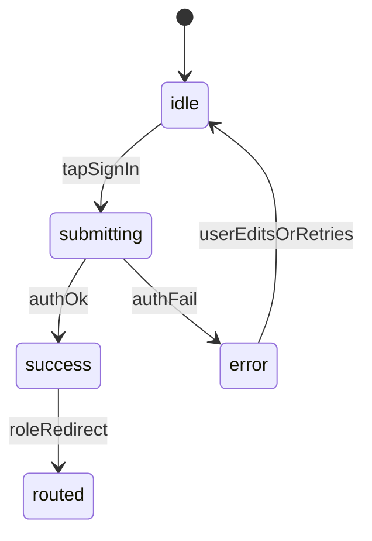

# Auth Register/Login Wireframe

This wireframe package redesigns login and all profile registration screens while keeping separate profile flows.

## 1) UX Audit Summary

## Shared issues
- Primary submit actions do not consistently show loading/disabled states across auth screens.
- Error feedback is mostly form-level and not always paired with clear next action.
- Visual structure differs by screen, creating inconsistent trust and comprehension.

## Login-specific issues
- `Sign in` in `app/login.tsx` does not lock the button during async auth.
- Users can tap repeatedly while waiting, causing confusion.
- Forgot-password result is shown in the same error text style, making success vs error unclear.

## Registration-specific issues
- `register-company`, `register-pump`, and `register-employee` use different hierarchy/visual density.
- No explicit "creating account..." state or disabled inputs during submit.

---

## 2) Low-Fi Wireframes

## Login

```text
+--------------------------------------------------+
| Brand: Fuel Credit                                |
| Subtitle: Sign in with your credentials           |
+--------------------------------------------------+
| [Email input..................................]   |
| [Password input...............................]   |
| [Inline status area: error/success/info]         |
| [Primary CTA: Sign In]                            |
| [Secondary CTA: Forgot Password]                  |
|--------------------------------------------------|
| Register options                                  |
| [Register Company]                                |
| [Register Pump]                                   |
| [Employee Signup]                                 |
+--------------------------------------------------+
```

## Register Company

```text
+--------------------------------------------------+
| Header: Register Company                          |
| Subtext: Create company owner account             |
+--------------------------------------------------+
| [Company Name]                                    |
| [GSTIN (optional)]                                |
| [Owner Display Name (optional)]                   |
| [Email]                                           |
| [Password]                                        |
| [Inline status area]                              |
| [Primary CTA: Create Account]                     |
| [Back to Sign In]                                 |
+--------------------------------------------------+
```

## Register Pump

```text
+--------------------------------------------------+
| Header: Register Pump                             |
| Subtext: Join and connect with companies          |
+--------------------------------------------------+
| [Pump Name]                                       |
| [Address]                                         |
| [Contact Number]                                  |
| [Owner Name]                                      |
| [Email]                                           |
| [Password]                                        |
| [Inline status area]                              |
| [Primary CTA: Create Pump Account]                |
| [Back to Sign In]                                 |
+--------------------------------------------------+
```

## Register Employee

```text
+--------------------------------------------------+
| Header: Employee Signup                           |
| Subtext: Use invited email to activate account    |
+--------------------------------------------------+
| [Invited Email]                                   |
| [Create Password]                                 |
| [Inline status area]                              |
| [Primary CTA: Create Employee Account]            |
| [Back to Sign In]                                 |
+--------------------------------------------------+
```

## Forgot Password Feedback State

```text
+--------------------------------------------------+
| On Forgot Password Tap                            |
| - Validate email first                            |
| - Show inline info/success message                |
| [Status chip/message: Reset link sent]            |
| [Resend after delay]                              |
+--------------------------------------------------+
```

---

## 3) Mid-Fi Login Interaction Flow

## State behavior
- **Idle**
  - `Sign In` enabled.
  - Inputs editable.
  - No loader visible.
- **Submitting**
  - On submit: button switches to loading (`loading=true`) and disabled.
  - Email/password fields become read-only until request resolves.
  - Inline helper text appears: `Signing in... please wait`.
  - Second taps are ignored.
- **Success**
  - Keep button disabled while routing.
  - Optional short success status: `Signed in. Redirecting...`.
- **Error**
  - Stop loader; re-enable inputs and button.
  - Show clear inline error.
  - Focus remains on form for immediate retry.



## Mid-fi login component behavior

```text
Primary button:
- title: "Sign In"
- loading: isSubmitting
- disabled: isSubmitting OR invalidForm

Input fields:
- editable: !isSubmitting

Status line under inputs:
- info: "Signing in... please wait"
- error: auth error text
- success: reset email sent / signed in
```

---

## 4) File-Level Implementation Map

## `app/login.tsx`
- Add `isSubmitting` state.
- Wrap `onLogin` with guard:
  - if already submitting, return.
  - set submitting true before async call, false in finally.
- Pass:
  - `loading={isSubmitting}`
  - `disabled={isSubmitting}` on sign-in button.
- Lock inputs during submit:
  - `editable={!isSubmitting}` and `selectTextOnFocus={!isSubmitting}`.
- Differentiate feedback channels:
  - info (reset sent), error (invalid auth), progress (signing in).

## `app/register-company.tsx`
- Add `isSubmitting` and apply the same loading/disable interaction contract.
- Disable inputs and primary button during submit.
- Add progress copy near CTA: `Creating account...`.

## `app/register-pump.tsx`
- Remove decorative emoji dependence for consistency with other auth screens.
- Normalize spacing and section order to match the auth pattern.
- Add `isSubmitting` + locked form while request runs.

## `app/register-employee.tsx`
- Add `isSubmitting` with button loading and disabled fields.
- Improve invite error text with one clear next step line under error.

## `src/components/ui/Button.tsx`
- Already supports `loading` and `disabled`; no API change required.
- Use existing behavior across all auth primary submits.

## `src/components/ui/Input.tsx`
- No structural change required.
- Consume existing `editable` from parent auth screens.

---

## 5) Acceptance Checklist

- Sign-in cannot be spam-clicked while auth is pending.
- User sees immediate progress feedback after tapping `Sign In`.
- All register flows share a consistent structure and CTA placement.
- All auth primary submits use loading + disabled states.
- Forgot-password feedback is clearly differentiated from errors.
