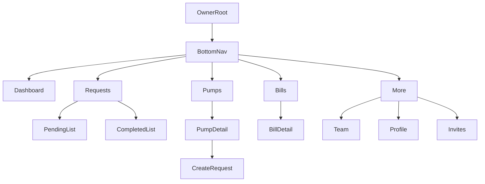

# Company Owner Module Wireframe

This document redesigns the company owner (`admin`) module to reduce clutter and improve task speed.

## 1) Current to Target IA

### Current Navigation (observed)
- Bottom tabs: `Dashboard`, `Pumps`, `Pending`, `Completed`, `Bills`, `Team`, `Profile` (+ hidden `Invites`)
- Heavy overlap between `Pending` and `Completed`
- Secondary actions mixed with primary actions in tabs

### Target Navigation (decluttered)
- Bottom tabs: `Dashboard`, `Requests`, `Pumps`, `Bills`, `More`
- Requests segmented inside one screen: `Pending | Completed`
- More contains secondary destinations: `Team`, `Profile`, `Invites`



---

## 2) Low-Fidelity Wireframes (All Owner Screens)

## Dashboard

```text
+--------------------------------------------------+
| Header: Dashboard                         [Bell] |
+--------------------------------------------------+
| CompanyName                                       
| [Outstanding Card] [Pending Card]                
| [Fuel Spend HSD] [Fuel Spend MS]                 
|--------------------------------------------------|
| Recent Fills                                     |
| [Vehicle] [Fuel+Amount] [Date]                  |
| [Vehicle] [Fuel+Amount] [Date]                  |
+--------------------------------------------------+
| BottomNav: Dashboard Requests Pumps Bills More   |
+--------------------------------------------------+
```

## Requests (Merged Pending + Completed)

```text
+--------------------------------------------------+
| Header: Requests                           [..]  |
+--------------------------------------------------+
| CompanyName                                       |
| [PumpFilterChips..............................]   |
| [Search Vehicle................................]  |
| [Segment: Pending | Completed]                   |
|--------------------------------------------------|
| RequestCard (two-row hierarchy)                  |
| Row1: Vehicle + Pump + StatusBadge              |
| Row2: Fuel | Qty/FullTank | Amount/Cash         |
|--------------------------------------------------|
| EmptyState / List                                 |
+--------------------------------------------------+
| BottomNav: Dashboard Requests Pumps Bills More   |
+--------------------------------------------------+
```

## Pumps List

```text
+--------------------------------------------------+
| Header: Pumps                             [Invite]|
+--------------------------------------------------+
| Context note (1 line only)                        |
|--------------------------------------------------|
| PumpCard                                          |
| Name + Address                                    |
| Outstanding + PendingCount                 [ > ]  |
|--------------------------------------------------|
| PumpCard ...                                      |
+--------------------------------------------------+
| BottomNav: Dashboard Requests Pumps Bills More   |
+--------------------------------------------------+
```

## Pump Detail

```text
+--------------------------------------------------+
| Header: PumpName                                  |
| Sub: Address                                      |
+--------------------------------------------------+
| [Outstanding Stat] [Pending Stat]                |
| [Primary CTA: New Fuel Request]                  |
|--------------------------------------------------|
| Recent Records                                   |
| [Vehicle][Fuel Qty Rate][Amount][Date]           |
| [Vehicle][Fuel Qty Rate][Amount][Date]           |
+--------------------------------------------------+
```

## Bills List

```text
+--------------------------------------------------+
| Header: Bills                                     |
+--------------------------------------------------+
| CompanyName                                       |
| [Segment: Awaiting Payment | Settled]            |
|--------------------------------------------------|
| BillCard                                          |
| BillNo + PumpName                                 |
| AmountDue                                  [Tag]  |
|------------------------------------------------>  |
+--------------------------------------------------+
| BottomNav: Dashboard Requests Pumps Bills More   |
+--------------------------------------------------+
```

## Bill Detail

```text
+--------------------------------------------------+
| Header: BillNo                                    |
+--------------------------------------------------+
| AmountDue Banner                                  |
| Status + Meta                                     |
| [Primary CTA if unpaid: Mark as Paid]            |
|--------------------------------------------------|
| BillView (line items / totals / dates)           |
+--------------------------------------------------+
```

## More (Hub)

```text
+--------------------------------------------------+
| Header: More                                      |
+--------------------------------------------------+
| [Team]                                            |
| [Invites]                                         |
| [Profile]                                         |
+--------------------------------------------------+
| BottomNav: Dashboard Requests Pumps Bills More   |
+--------------------------------------------------+
```

## Team

```text
+--------------------------------------------------+
| Header: Team                               [+Add] |
+--------------------------------------------------+
| EmployeeCount Badge                                |
|--------------------------------------------------|
| EmployeeCard                                       |
| Avatar Name                                        |
| Email + Status                                     |
|--------------------------------------------------|
| EmptyState: Add your first employee               |
+--------------------------------------------------+
```

## Add Member

```text
+--------------------------------------------------+
| Header: Add Team Member                            |
+--------------------------------------------------+
| Intro: why this matters                            |
| [Input: Employee Name]                             |
| [Input: Employee Email]                            |
| [Primary CTA: Create Employee]                     |
+--------------------------------------------------+
```

## Invites

```text
+--------------------------------------------------+
| Header: Invites                                    |
+--------------------------------------------------+
| Short helper copy                                  |
| [Primary CTA: Generate New Code]                   |
| [Latest Code Highlight]                            |
|--------------------------------------------------|
| Invite History Card                                |
| Code + StatusBadge                                 |
| CreatedDate + Redeemed/Expired                     |
+--------------------------------------------------+
```

## Profile

```text
+--------------------------------------------------+
| Header: Profile                                    |
+--------------------------------------------------+
| Avatar + Name + Role                               |
| Account Info Card                                  |
| [Secondary: Edit Profile]                          |
| [Danger: Log Out]                                  |
+--------------------------------------------------+
```

---

## 3) Mid-Fidelity Flow (Refined): Requests -> Pump -> Create Request -> Confirmation

## A. Requests (Pending tab active)
- Sticky top area: `Company`, `Filter chips`, `Search`, `Pending/Completed segment`
- Card hierarchy:
  - Primary: `Vehicle` (left), `Status` (right)
  - Secondary: `PumpName`, `Fuel`, `Qty/FullTank`, `Cash/Amount`
- Tap card action: open `Pump Detail` filtered context

## B. Pump Detail
- Compact stat row with only two numbers: `Outstanding`, `Pending`
- Prominent single CTA: `New Fuel Request`
- Recent records collapsed to 4 items with `View all` if needed

## C. Create Request (progressive disclosure)
- Step block order:
  1. `Vehicle number` (with history suggestions)
  2. `Fuel type` and `Quantity`
  3. `Optional details` accordion: `Extra cash`, `Notes`, `Full tank`
- Validation behavior:
  - Quantity required unless full tank checked
  - CTA disabled until mandatory fields are valid
- Sticky footer CTA: `Raise Fuel Request`

## D. Confirmation
- Success sheet:
  - Title: `Request Sent`
  - Summary line: `Vehicle + Pump + Fuel`
  - Actions: `Back to Pump`, `Create Another`

```text
RequestsList -> PumpDetail -> CreateRequestForm -> SuccessSheet
      ^                                           |
      +-------------------------------------------+
```

---

## 4) Implementation Checklist (Mapped to Existing Files)

- **Navigation simplification**
  - Update tabs to `Dashboard`, `Requests`, `Pumps`, `Bills`, `More` in `/home/hodorinfo/Desktop/Fuel_app/app/(admin)/(tabs)/_layout.tsx`
  - Move `team`, `profile`, `invites` entry under a `more` route group/screen

- **Requests merge and declutter**
  - Consolidate shared chrome from:
    - `/home/hodorinfo/Desktop/Fuel_app/app/(admin)/(tabs)/pending.tsx`
    - `/home/hodorinfo/Desktop/Fuel_app/app/(admin)/(tabs)/completed.tsx`
  - Build common header/filter/search shell using `/home/hodorinfo/Desktop/Fuel_app/src/components/ui/CompanyFilterBar.tsx`
  - Recompose cards into 2-row hierarchy with reusable request item component

- **Pump flow cleanup**
  - Keep pump list action density low in `/home/hodorinfo/Desktop/Fuel_app/app/(admin)/(tabs)/pumps.tsx`
  - Ensure single primary action in `/home/hodorinfo/Desktop/Fuel_app/app/(admin)/pumps/[id]/index.tsx`
  - Apply progressive disclosure in `/home/hodorinfo/Desktop/Fuel_app/app/(admin)/pumps/[id]/request.tsx`

- **Team flow deduplication**
  - Remove one duplicate add-member entry path; keep only one canonical route:
    - `/home/hodorinfo/Desktop/Fuel_app/app/(admin)/employee-new.tsx` or
    - `/home/hodorinfo/Desktop/Fuel_app/app/(admin)/team/new.tsx`
  - Point all team add actions to canonical route from `/home/hodorinfo/Desktop/Fuel_app/app/(admin)/(tabs)/team.tsx`

- **Bills and profile polish**
  - Preserve bill segmented state in `/home/hodorinfo/Desktop/Fuel_app/app/(admin)/(tabs)/bills.tsx` but align spacing/typography with requests pattern
  - In `/home/hodorinfo/Desktop/Fuel_app/app/(admin)/(tabs)/profile.tsx`, separate neutral actions from destructive action (`Log Out`)

- **Invites discoverability**
  - Keep invite generation flow in `/home/hodorinfo/Desktop/Fuel_app/app/(admin)/(tabs)/invites.tsx` but surface access under `More` instead of hidden tab behavior

---

## 5) Component-Level UX Standards (for coding phase)

- One primary action per screen.
- Keep filter/search area sticky only when list exceeds one viewport.
- Limit list-card text to 2 visual levels (title line + meta line).
- Convert optional form fields to collapsed sections by default.
- Use consistent section spacing (`16` outer, `12` between groups, `8` between micro-items).
